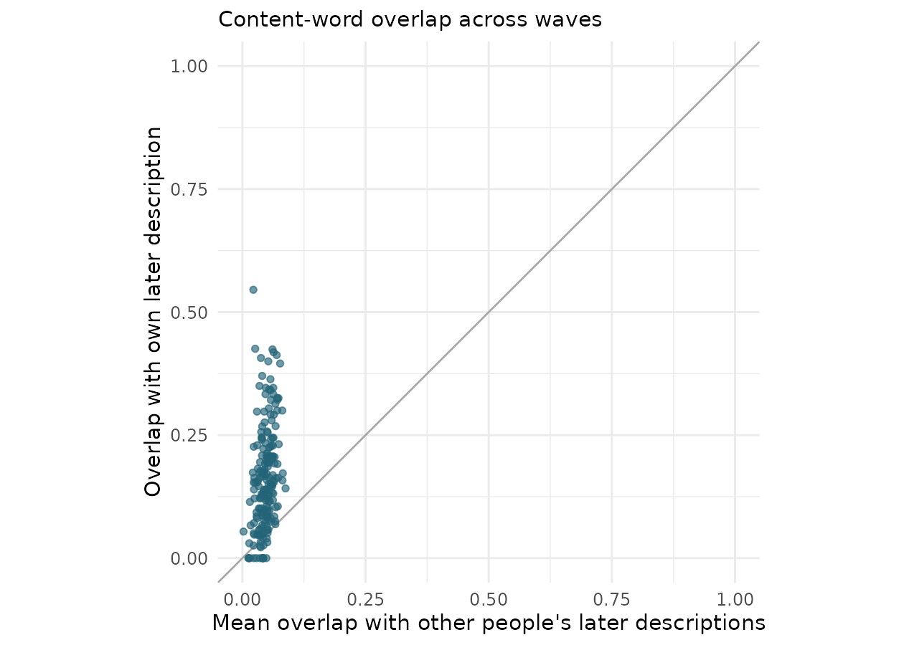
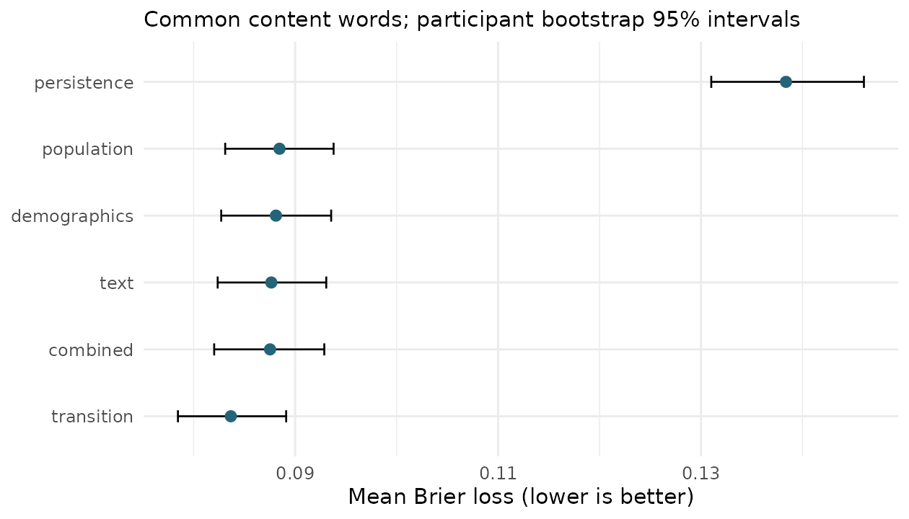

```{r}
library(tidyverse)
r <- function(f) read_csv(file.path("results",f),show_col_types=FALSE)
lex <- r("lexical_summary.csv")
txt <- r("text_forecast_summary.csv")
ws <- r("word_score_summary.csv")
con <- r("word_brier_contrasts.csv")
cov <- r("vocabulary_coverage.csv")
audit <- r("data_audit.csv")
sample <- r("sample_summary.csv")
sens <- r("sensitivity.csv")
parts <- r("partition_sensitivity.csv")
orig <- r("original_split_summary.csv")
ind <- r("lexical_individual.csv")
fmt <- function(x,k=3) formatC(x,format="f",digits=k)
lv <- function(n) lex$estimate[lex$name==n]
wv <- function(m,n="brier") ws$estimate[ws$model==m & ws$name==n]
ci <- function(z,k=3) paste0(fmt(z$estimate,k)," [",fmt(z$lower,k),", ",fmt(z$upper,k),"]")
lc <- function(n) ci(filter(lex,.data$name==.env$n))
wc <- function(m,n="brier") ci(filter(ws,.data$model==.env$m,.data$name==.env$n),4)
```

## Abstract

How predictable are human selves when observed through their own words? We examine 200 publicly released pairs of self-descriptions from the JJJ Pro Who am I survey. Participants answered a Twenty Statements Test prompt in 2024 and at a later follow-up. We distinguish continuity of wording, prediction of entire responses, and probabilistic prediction of common content words. Mean within-person content-word Dice similarity was `r lc("dice")` (95% participant bootstrap interval), compared with `r fmt(lv("other_dice"))` between people. Repeating the earlier response outperformed both a generic response and a text-neighbor forecast on lexical overlap. Yet treating each earlier word as certain to recur performed poorly as a probabilistic forecast. In participant-level cross-validation, a smoothed word-transition model reduced Brier loss by `r fmt(100*(1-wv("transition")/wv("population")),1)`% relative to training-sample prevalence. Demographic and multivariate text models produced smaller improvements. These forecasts cover only common words: the evaluated vocabularies contained, on average, `r fmt(100*mean(cov$covered/cov$observed_content_words),1)`% of each person's later content-word types. The results establish modest, person-specific predictability of lexical expression alongside substantial variation in wording. They do not identify an upper limit on semantic self-predictability or distinguish identity change from changes in what people choose to mention.

**Keywords:** self-description; identity; longitudinal prediction; Twenty Statements Test; computational social science

## Introduction

A person can remain recognizably the same while describing themselves differently. Roles can endure without being mentioned again; new wording can express an old commitment. Conversely, repeating a familiar phrase need not imply that a person's circumstances have remained constant. These distinctions make the question “How predictable are human selves?” empirically tractable only after specifying what is observed and what counts as a successful prediction.

Self-authored descriptions offer one concrete observation. The Twenty Statements Test asks respondents to describe who they are in their own terms [@kuhn1954]. Jones's Ipseome project extends this tradition by making personally expressed identity data available for reuse, including repeated elicited descriptions [@jones2026]. Such text provides evidence about the presentation and salience of identity. It does not exhaust the underlying person.

Prediction also needs a comparison standard. Explanatory plausibility does not guarantee accurate forecasts [@hofman2017]. In the Fragile Families Challenge, extensive modeling and rich background information yielded limited improvements over simple benchmarks for several life outcomes [@salganik2020]. That finding concerns a different population and different outcomes, but motivates the discipline of measuring improvement rather than assuming complexity helps. Here, an earlier self-description supplies an unusually direct baseline: predict that the person will say the same things again.

Previous longitudinal work has studied changes in the lexical and semantic composition of Twitter biographies [@vahabli2025], and repeated Twenty Statements Test responses have been studied during contemplative training [@lumma2017]. The present study asks a complementary forecasting question. How much does an earlier response help predict a later response from a participant excluded from model fitting? Is the useful information primarily that an already-used word might recur, or do broader textual and demographic patterns substantially improve prediction?

We distinguish three outcomes. First, within-person overlap measures continuity relative to between-person similarity. Second, whole-response forecasts are evaluated against actual later text. Third, probabilistic forecasts estimate the presence of common words. These outcomes need not rank forecasting strategies identically. A copied response may be the best available string while being an overconfident statement about which individual words will recur. Making that difference explicit is the central contribution of this analysis.

## Data and design

### Source and analytic sample

We use the public two-wave JJJ Pro Who am I files distributed by Jones in the *Predict Future Selves* repository [@data2026]. The source version is commit `9b6a766712583fec8d3182957260b1123fbfa146`, retrieved on September 25, 2026. We use its 150 training and 50 development pairs as a 200-person secondary-analysis sample. The repository's remaining 81 cases have no public follow-up text and cannot contribute to outcome evaluation. This study uses the repository as a data source; it does not enter its prediction task or evaluate its private test set.

The versioned data statement reports recruitment through Prolific, responses through Qualtrics, and informed consent including public release. Inclusion in the source cohort required approved submissions and finished, consented, nonblank responses at both waves. The publisher linked waves using private participant identifiers and assigned new public IDs. The 281-person source cohort was split by a deterministic seeded hash, without demographic stratification. We rely on that linkage and eligibility documentation; public files do not permit an independent audit against administrative records.

The same documentation reports a median interval of 433 days, a range of 424–750 days, and 33 follow-ups collected in 2026 rather than 2025. These summaries describe the full 281-person cohort, not necessarily our 200-person subset. The column name `tst_2025` denotes the follow-up wave. Exact response dates are absent, so we neither estimate a time-decay curve nor describe the observations as uniformly one year apart.

Our sample contains `r sample$n` distinct participants, including `r sample$female` recorded as female and `r sample$male` as male in baseline platform metadata. Baseline age averaged `r fmt(sample$age_mean,1)` years (SD `r fmt(sample$age_sd,1)`; range `r sample$age_min`–`r sample$age_max`). Both texts are nonmissing for every included participant. No pair is identical either verbatim or after lowercasing and whitespace normalization. No baseline or follow-up text is duplicated within its respective wave. Median response lengths are `r median(ind$words_baseline)` and `r median(ind$words_followup)` alphabetic tokens at baseline and follow-up. Supplementary files report demographic counts and missingness.

The sample is selected by recruitment, return, approval, and availability of public labels. It should not be interpreted as a representative panel of American adults merely because the initial recruitment sought demographic coverage. We do not have the information needed to correct for attrition or selection. Follow-up demographic fields are excluded from every forecasting model.

### Additional-data search

We searched for other available longitudinal self-authored descriptions, following both suggested references and targeted searches for repeated Twenty Statements Test responses and social-media biographies. The search log records candidate sources and access decisions. The ReSource project has repeated elicited descriptions [@lumma2017], but we did not locate downloadable linked raw texts. Vahabli and Jones's data statement offers data on request [@vahabli2025]. Other resources inspected offered unlinked self-image norms, aggregate identity frequencies, or occupational transition summaries rather than paired individual descriptions. We therefore conduct no second-dataset replication. This is a bounded access result from a targeted search, not a claim that no other suitable data exist.

### Analysis status and validation design

This is exploratory secondary research, not a preregistered test. An analysis protocol was recorded after inspection of metadata and three training examples and before the initial scores. Later sensitivity checks and a documented correction to the stop list are identified in the supporting materials. There is no claim that analysts were blind to all outcomes throughout development.

We assign the 200 participants to five equally sized folds using seed 20260925. For each fold, all model fitting uses the other 160 participants; both descriptions from a held-out person are excluded from training. Input vocabularies, inverse document frequencies, demographic encodings, target vocabularies, and penalty tuning are fitted on training participants. This estimates transfer to other respondents from the same available cohort. It is not a deployment test on a later calendar cohort.

## Measures and forecasting methods

### Text representation and overlap

We lowercase text, extract consecutive Unicode letters, and remove single-character tokens and a fixed, published list of English grammatical and filler words. The list retains negations such as “not” and does not merge synonyms or stem words. We call the remaining tokens *content words* as an operational convenience, not as a validated classification of identity content. Numerals, punctuation, emoji, word order, and within-response repetition are omitted from the primary set representation. Analyses retaining grammatical words and using character trigrams test dependence on this choice.

For predicted word set $A$ and observed set $B$, Dice similarity is $2|A\cap B|/(|A|+|B|)$. We also report Jaccard similarity, $|A\cap B|/|A\cup B|$, prediction precision, $|A\cap B|/|A|$, and target recall, $|A\cap B|/|B|$. Scores are calculated per participant and then averaged, so long responses do not receive greater weight. The primary scores range from zero to one.

For descriptive continuity, each baseline response is compared with its own follow-up and separately with all 199 other follow-ups. We average the latter comparisons within participant. A permutation test shuffles follow-up assignment 9,999 times. As a distinct, retrospective identification exercise, we rank all 200 observed follow-ups by similarity to a baseline. Top-rank ties receive fractional credit. Identification is easier than generating an unseen future and must not be mistaken for a forecasting accuracy.

### Whole-response forecasts

We compare three transparent forecasts: repeat the participant's own earlier response; use a generic training follow-up chosen as the medoid under content-word Dice similarity; or use the follow-up of the nearest training participant's baseline. The nearest neighbor is selected by cosine similarity of binary baseline word incidence weighted by training-baseline inverse document frequency, $1+\log[(n+1)/(df+1)]$. Ties are resolved deterministically by file order. The medoid maximizes mean similarity to the other training follow-ups.

All three methods are evaluated on the same held-out participants. In addition to set overlap, we report all-word Dice, training-vocabulary TF-IDF cosine, and absolute error in response word count. A method may succeed at typical response length while missing personal content; no composite score hides that distinction.

### Common-word probabilities

Within each training fold, target words must appear in at least ten follow-up descriptions. Each held-out participant receives a probability for every word in that fold's target vocabulary. We compare six models:

1. **Population:** smoothed training follow-up prevalence, $(s+0.5)/(n+1)$.
2. **Certain persistence:** probability one if the word appeared at baseline, zero otherwise.
3. **Word transitions:** separate recurrence and appearance probabilities conditional on the same word's baseline presence, with five pseudo-observations centered on its population prevalence. Thus $p(y_w=1\mid x_w=a)=(s_{wa}+5p_w)/(n_{wa}+5)$.
4. **Demographics:** ridge linear probability regression using available baseline demographic fields.
5. **Text:** ridge regression using baseline content-word incidence and log one plus content-token count.
6. **Combined:** the text and demographic predictors together.

For text regressions, input words must occur in at least three training baselines. Age is numeric; other demographic fields are one-hot encoded, with a missing category and training-only levels. Constant features are removed. Features are centered and scaled on training participants. Each target word has its own coefficients and intercept, with a common ridge penalty selected by three-fold inner cross-validation from 0.01, 0.1, 1, 10, and 100. Inner-fold vocabularies are learned anew. The objective is mean squared error plus the penalty on squared coefficients; intercepts are unpenalized. Predictions are clipped to [0,1] before tuning and evaluation. These are regularized linear probability models, not semantic language models.

Brier loss averages squared probability error across target words within participant; lower is better. We also report average precision for ranking the target words, handling tied scores as threshold groups. Average precision is undefined if a participant uses none of the evaluated words, and those cases are omitted only from that metric. We separately evaluate words present and absent at baseline. “Appearance” means a word is newly observed in the response, not that a new identity has been acquired.

Uncertainty intervals use 4,000 participant bootstrap resamples. Method contrasts use paired differences. These intervals are conditional on the fitted cross-validation predictions: they describe participant variation but do not fully incorporate uncertainty from refitting models or choosing folds. They should not be read as definitive significance tests of small differences among models. The permutation test addresses the narrower null of exchangeable respondent linkage. No multiplicity-adjusted claims about individual words or demographic subgroups are made.

## Results

### Personal continuity exceeds shared vocabulary

Within-person content-word Dice similarity averaged `r lc("dice")`, compared with `r lc("other_dice")` for other people. The mean paired difference was `r lc("paired_advantage")`. No permuted assignment reached the observed mean; the Monte Carlo p-value, including the observed arrangement, was 0.0001. Jaccard similarity averaged `r lc("jaccard")`.

{#fig-continuity}

An earlier response recovered an average of `r fmt(100*lv("recall"),1)`% of the unique content words in the later response. Conversely, `r fmt(100*lv("precision"),1)`% of earlier content words reappeared. These two participant-averaged quantities differ because response lengths differ. They describe word types, not the fraction of a person's identity that persisted or changed.

The correct later description ranked first among 200 candidates in `r fmt(100*lv("top1_credit"),1)`% of cases after fractional tie credit (chance expectation 0.5%). Thus fairly low absolute overlap can still carry considerable distinguishing information. Most candidates are even less similar. This retrospective identification result establishes distinctiveness within this candidate pool, not the ability to recover an unknown person's future text.

### Repetition is a useful string forecast

```{r}
#| label: tbl-text
#| tbl-cap: "Whole-response forecasting: participant means and 95% bootstrap intervals. Higher overlap and cosine are better; lower word-count error is better."
txt |> filter(name %in% c("dice","all_word_dice","tfidf_cosine","word_count_error")) |>
  mutate(value=ci(pick(everything()))) |> select(method,name,value) |>
  pivot_wider(names_from=name,values_from=value) |>
  rename(Forecast=method,`Content Dice`=dice,`All-word Dice`=all_word_dice,
         `TF-IDF cosine`=tfidf_cosine,`Word-count MAE`=word_count_error) |> knitr::kable()
```

Repeating the earlier response performed best on all reported lexical agreement metrics. The generic medoid was more competitive than nearest-neighbor transfer, showing that a superficially similar earlier description does not ensure a similar later one. These comparisons support a person-specific signal beyond the vocabulary of a typical respondent. However, the generic forecast had lower word-count error than repetition. Predictability depends on whether the target is personal content or response form.

### Uncertain persistence beats certain repetition

Target vocabularies contained `r min(cov$vocabulary_size)`–`r max(cov$vocabulary_size)` words per fold. They covered an average of `r fmt(100*mean(cov$covered/cov$observed_content_words),1)`% of held-out participants' later content-word types (`r fmt(100*sum(cov$covered)/sum(cov$observed_content_words),1)`% when pooling types across participants). The following results therefore apply to a frequent-word subset, not unrestricted future language.

```{r}
#| label: tbl-words
#| tbl-cap: "Common-word forecasts. Brier loss is averaged within participant. AP denotes average precision; AP means omit participants with no positive target words."
ws |> filter(name %in% c("brier","average_precision","ap_absent")) |>
  mutate(value=paste0(ci(pick(everything()),4),"; n=",n)) |>
  select(model,name,value) |> pivot_wider(names_from=name,values_from=value) |>
  rename(Model=model,`Brier loss`=brier,AP=average_precision,`Absent-word AP`=ap_absent) |> knitr::kable()
```

The transition model achieved Brier loss `r wc("transition")`, compared with `r wc("population")` for population prevalence. The paired loss reduction was `r ci(filter(con,contrast=="population minus transition"),4)`, equivalent to `r fmt(100*(1-wv("transition")/wv("population")),1)`% of the population loss. Certain persistence was substantially worse than population prevalence: earlier mentions often did not recur, making zero-or-one predictions overconfident.

{#fig-brier}

The demographic, text, and combined ridge models improved only slightly over prevalence and were less accurate than the transition model. This does not demonstrate that demographics or multivariate relationships are uninformative in larger samples. It establishes that these particular regularized models did not extract a larger gain from this sample. The simple transition model gives each word's own history a privileged role, whereas multivariate ridge must estimate that relationship among many predictors from 160 training people.

For words already present, transition-model Brier loss was `r fmt(wv("transition","brier_present"),4)`, compared with `r fmt(wv("population","brier_present"),4)` for prevalence. For absent words, the corresponding losses were `r fmt(wv("transition","brier_absent"),4)` and `r fmt(wv("population","brier_absent"),4)`. The gain was therefore larger among earlier mentions. Some improvement for absent words is expected because a person's nonmention also contains information about recurrence propensity. Absent-word average precision changed little between prevalence and transitions. Predicting new wording remained substantially less successful than ranking the full common-word set.

### Sensitivity and implementation checks

```{r}
#| label: tbl-sensitivity
#| tbl-cap: "Exploratory sensitivity checks: own-person minus comparison overlap. Character-trigram Dice is a different scale from word Dice."
sens |> mutate(`Mean difference [95% interval]`=ci(pick(everything()))) |>
  select(Check=check,n,`Mean difference [95% interval]`) |> knitr::kable()
```

The personal continuity advantage persisted after excluding the highest-overlap response pairs, restricting both responses to at least 20 words, and replacing word sets with character trigrams. Comparing each person with same-sex participants within ten years of baseline age also left a positive advantage. Matching does not eliminate all shared background or writing-style explanations, but the result is not explained solely by age and sex differences across the full comparison pool.

The transition model's advantage over prevalence also survived 20 alternative five-fold partitions: mean Brier reductions ranged from `r fmt(min(parts$improvement),4)` to `r fmt(max(parts$improvement),4)`. These partitions reuse the same people and are not independent replications. Requiring five or twenty training follow-ups per target word, rather than ten, retained the advantage, though the prediction vocabulary and coverage changed substantially. Using the publisher's original 150/50 split yielded a loss reduction of `r ci(orig,4)` in the 50 public development cases. This is an additional fixed-split analysis, not an untouched confirmatory test. The supplement reports the full checks.

Reproducibility checks matched downloaded files to their published Git object hashes, verified participant folds and donor exclusions, independently recomputed every within-person Dice score and every transition probability, and reconstructed every reported participant-model Brier score from saved predictions. These checks validate implementation, not the underlying respondent linkage or construct validity.

## Discussion

The evidence supports a qualified answer to the research question. Later self-description contains a reproducible personal lexical signal. Earlier wording is more useful than a generic description or the later wording of a textually similar stranger. Yet most individual content-word types are not reused, and treating persistence as certain is a poor forecast. A small probabilistic model that allows both retention and omission performs better than simply assuming no change.

The apparent tension between copying text and moderating word probabilities is informative. Overlap rewards words a copied string gets right without asking whether each copied word was confidently justified. Brier loss explicitly penalizes unwarranted certainty. The same source of continuity can therefore make copying a good string baseline and a poor probability model. Any claim that a self is “predictable” should specify the output, score, vocabulary, and comparison population.

The findings do not reveal how much of the latent self changed. People may choose different facets of an enduring identity, substitute synonyms, change format, or answer with different effort. A role can disappear from a response while remaining central in life. Word-set analysis also discards ordering, emphasis, grammatical relations, and contextual negation. Low lexical agreement is consequently not equivalent to low semantic continuity. High agreement, conversely, can reflect habitual phrasing rather than deep stability. The study directly measures later expression, a narrower and more observable outcome than selfhood.

The contribution is an empirical lower bound on achievable lexical forecasting in this selected sample, not an upper bound on human predictability. We evaluate transparent finite-sample baselines, not all possible models, human forecasters, or generative language systems. Stronger semantic representations, information about intervening events, or larger training samples could improve performance. A language model comparison would require its own careful design: contamination of public texts, semantic hallucinations, and evaluation that rewards plausible but untrue descriptions are material concerns. Those possibilities do not change what the present executed forecasts establish.

Several limitations constrain generalization. First, 200 selected returning participants provide limited information about rare identity expressions, and frequent-word scores cover only a minority of later word types. Second, there is no independent cohort replication, and exact intervals cannot be modeled. Third, baseline demographic fields can be missing or reflect platform-profile updates; they are not complete social histories. Fourth, the five training sets overlap, so conditional bootstrap intervals understate some sources of uncertainty. Small differences among ridge variants should not be taken as substantive rankings of information sources. Fifth, a single observed follow-up cannot tell whether an alternative description would also have been a valid response from that person. Finally, the source materials acknowledge heterogeneous response formats and possible machine-generated responses. We retain the released observations without claiming to identify authorship reliably from writing style.

The most defensible conclusion is that individual continuity is detectable without literal repetition. A past description helps predict a later description, especially whether familiar words will recur, but it is a partial guide whose uncertainty matters. Further work should preserve this separation between persistence, newly mentioned content, semantic continuity, and the broader life that no short self-description fully records.

## Data, code, and research transparency

The data are attributed to Jason Jeffrey Jones and used under CC BY-NC-SA 4.0 [@data2026]. Original CSV files, their license, downloaded provenance, hashes, all R scripts, participant-level scores, out-of-fold word probabilities, figures, and software versions accompany this article. Running `Rscript analysis/run_all.R` from the repository root regenerates the analyses and verification record. The README documents article rendering. No private answer key, external submission, new participant recruitment, or attempt at reidentification was used.

The source data statement reports participant consent to public release. This secondary analysis makes no claim of a newly obtained ethics approval. Free text and demographic combinations can remain sensitive despite removal of direct identifiers; we present aggregate findings rather than illustrative quotations tied to participants. The retrospective matching analysis is limited to the supplied candidate pool and is not an attempt to identify real people.

An AI coding assistant supported literature discovery, analysis programming, verification, and manuscript drafting. It did not generate the empirical observations. The accompanying scripts and saved predictions expose the calculations for independent review. Author identity, contribution statements, and journal-specific administrative declarations are intentionally outside this anonymized manuscript.

## References
